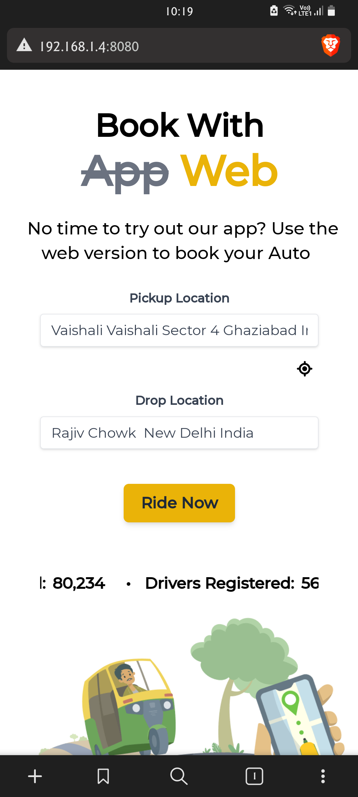
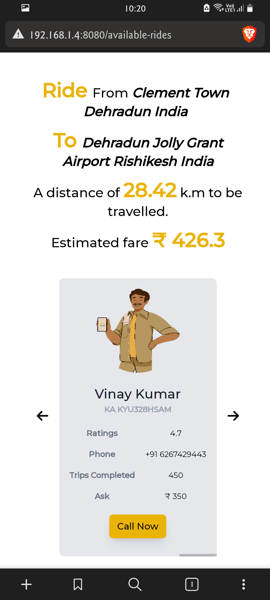
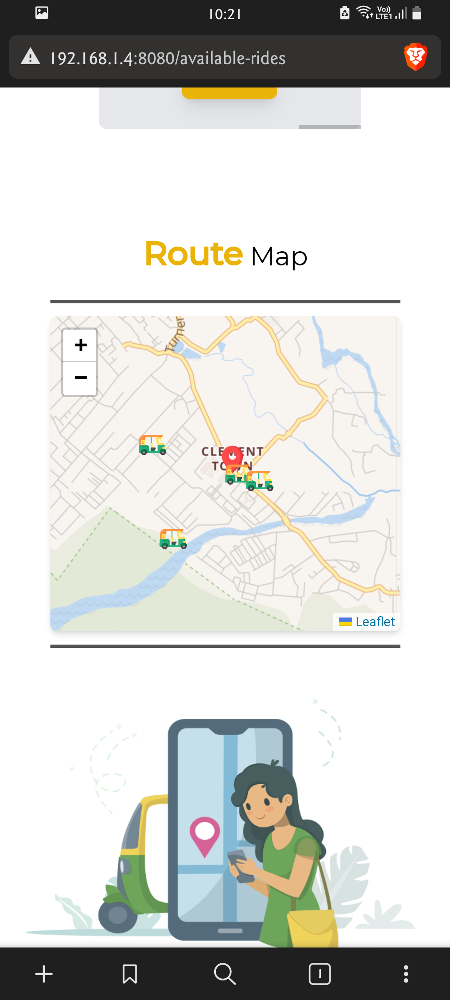

## Book-My-Auto
Part of Namma Yatri Open Mobility Challenge.


### Screenshots

Home Page                  |   Rides Page              |         Route Map
:-------------------------:|:-------------------------:|:-------------------------:
    |    |     
 
### Installation & Dependencies

- [NodeJS](https://nodejs.org/en)
- [VueJS](https://vuejs.org/)
- [GeoApify API Key](https://www.geoapify.com/)

### Usage

- Open Terminal/ Command Prompt, then navigate to the `project` directory and type in:

```bash
npm install
```

- Once everything is setup, type in:

```bash
npm run serve
```

- The above command should result in something like this:

```bash
> frontend@0.1.0 serve
> vue-cli-service serve

 INFO  Starting development server...
 DONE  Compiled successfully in 7988ms

  App running at:
  - Local:   http://localhost:8080/ 
  - Network: http://192.168.134.61:8080/
```

> Note: Do not forget to plug-in your API key inside `(src/store/index.js` store object.

### To-Do

- [ ] Add real-time location
- [ ] Location Auto complete
- [ ] User authorization
- [ ] Improve styling
